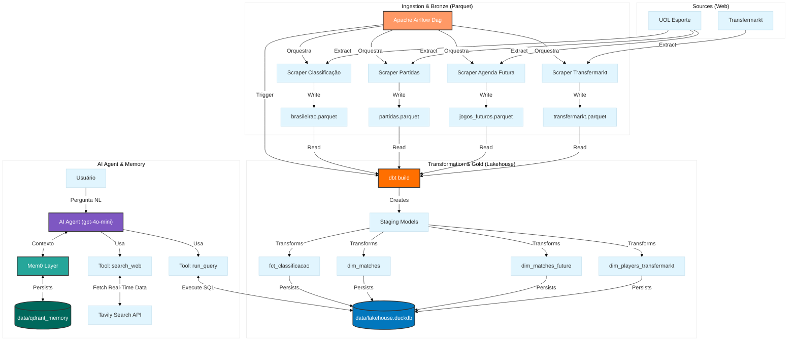

# 🏟️ Brasileirão 2026: Data Lakehouse & AI Analítico

Este projeto é um ecossistema de dados ponta a ponta que transforma informações brutas do Campeonato Brasileiro 2026 e do mercado de transferências em inteligência analítica. O sistema combina um **Data Lakehouse local** com um **Agente de IA (NL2SQL)** dotado de memória de longo prazo e capacidade de pesquisa web para responder consultas complexas via linguagem natural.

## 🚀 Arquitetura do Sistema

O pipeline segue a filosofia de **Medallion Architecture** (Bronze, Silver e Gold), garantindo dados limpos, tipados e prontos para consumo. A orquestração paralela e a camada de IA garantem um fluxo contínuo e inteligente:



### Detalhamento das Camadas

1.  **Ingestão (Bronze):** Scrapers customizados em Python (`curl_cffi` + `Regex` + `BeautifulSoup`) extraem estatísticas do UOL e dados financeiros do Transfermarkt, driblando bloqueios de Cloudflare e persistindo em arquivos **Parquet** de forma idempotente.
2.  **Orquestração:** **Apache Airflow** (via Astro CLI) gerencia o fluxo em paralelo, garantindo que o processamento do dbt só inicie após a extração bem-sucedida de todas as fontes.
3.  **Transformação (Silver/Gold):** O **dbt (data build tool)** com adapter **DuckDB** realiza a limpeza, casting de tipos, tratamento de moedas/conversões financeiras pesadas e criação de métricas de negócio.
4.  **Armazenamento:** **DuckDB** atua como motor de Lakehouse local, oferecendo performance analítica de alto nível com zero infraestrutura.
5.  **Camada de IA:** Um agente baseado em **GPT-4o-mini** utiliza *Function Calling* para orquestrar as respostas: ele traduz perguntas em queries SQL precisas para dados tabulares, e utiliza a web para contexto dinâmico.
6.  **Memória Persistente:** Integração com **Mem0** e **Qdrant** (Vector Database) para permitir que o agente aprenda e recorde preferências do usuário entre diferentes sessões.

## 🧠 Diferenciais Técnicos

-   **Web Scraping Avançado:** Substituição de frameworks pesados (como Selenium/Playwright) pelo `curl_cffi` com impersonação de navegador (`chrome120`) e injeção de headers/cookies para burlar telas de consentimento (CMPs) e proteções antibot do Transfermarkt.
-   **Modelagem Defensiva (Anti-Join):** Uso avançado de SQL no dbt para resolver duplicações temporais, garantindo que a agenda de jogos futuros seja atualizada dinamicamente sem colidir com jogos recém-finalizados.
-   **Busca Agentic Híbrida:** O LLM possui autonomia para decidir entre consultar a fonte oficial da verdade (DuckDB) via `run_query` ou buscar dados de última hora (notícias, lesões, clima) via ferramenta `search_web` integrada ao **Tavily**.
-   **Consolidação Esportiva e Financeira:** Cruzamento de dados estruturados para análises complexas, incluindo limpeza de strings financeiras (conversão de "€ X.XX mi" para `BIGINT` através do dbt).
-   **Local-First & Portável:** Todo o estado da aplicação (Dados no DuckDB e Memória no Qdrant) reside na pasta `data/`, permitindo backup e portabilidade total do projeto.

## 🛠️ Stack Tecnológica

-   **Linguagem:** Python 3.12 (Gerenciado com `uv`)
-   **Orquestração:** Apache Airflow (Astro CLI)
-   **Transformação:** dbt-core
-   **Bancos de Dados:** DuckDB (Relacional/Analítico) & Qdrant (Vetorial)
-   **IA/LLM:** OpenAI API & Mem0 (Memory Layer)
-   **Extração & Pesquisa:** curl_cffi (Scraping) & Tavily API (Web Search)

## 📈 Estrutura de Pastas

```text
├── agent/               # Lógica do Agente de IA, Memória e Tools (Tavily/SQL)
├── dags/                # Orquestração das extrações (Airflow)
├── data/                # Lakehouse (DuckDB) e Memória Vetorial (Qdrant)
├── dbt_brasileirao/     # Modelos dbt (Staging e Marts com Anti-Joins)
├── include/             # Scrapers (UOL, Transfermarkt) e scripts de suporte
└── main.py              # Interface de chat via terminal
```

## ⚙️ Como Executar

1.  **Instale as dependências:**
    ```bash
    uv sync
    ```
2.  **Configure as variáveis de ambiente:**
    Crie um arquivo `.env` na raiz do projeto contendo:
    ```env
    OPENAI_API_KEY=sua_chave_aqui
    TVLY_API_KEY=sua_chave_tavily_aqui
    USER_ID=seu_usuario_exemplo
    ```
3.  **Inicie o Pipeline:**
    ```bash
    astro dev start
    ```
4.  **Inicie o Agente Analítico:**
    ```bash
    uv run python main.py
    ```

---